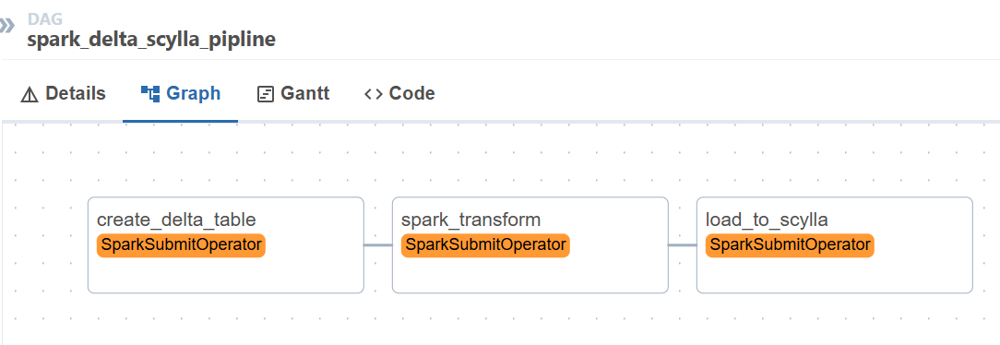
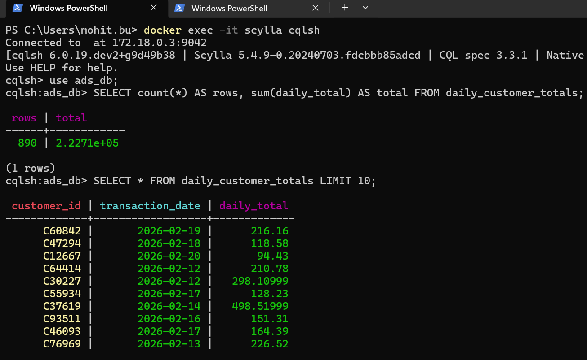
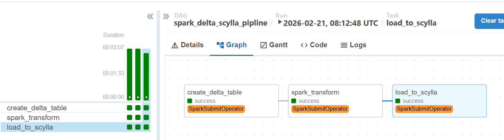
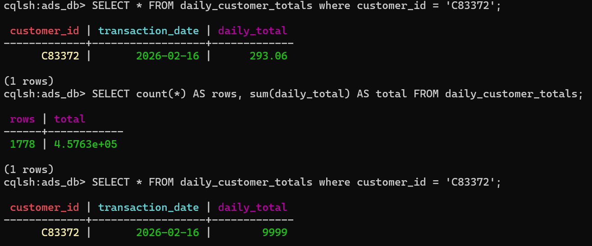
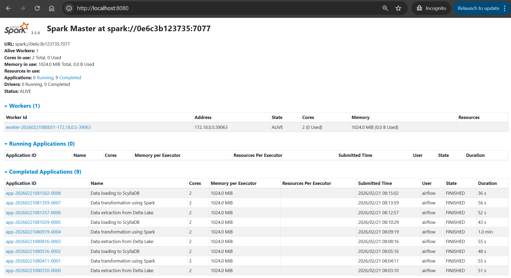

# 🚀 Delta Lake + Spark + ScyllaDB + Airflow Pipeline


---

## 📌 Overview

An end-to-end modern data engineering pipeline simulating a real-world **AdTech-style** transactional workflow. Raw customer transaction events are ingested, stored in Delta Lake with ACID guarantees, transformed via Spark ETL, and upserted into ScyllaDB — all orchestrated by Apache Airflow running in Docker.

---

## 🎯 Key Features

| Feature | Implementation |
|---|---|
| ACID Storage | Delta Lake with versioning |
| ETL Processing | Apache Spark 3.5 |
| High-speed DB | ScyllaDB (Cassandra-compatible) |
| Orchestration | Apache Airflow DAG |
| Infrastructure | Docker Compose |
| Data Quality | Deduplication + validation |
| Load Strategy | Idempotent UPSERT |

---

## 🏗️ Architecture

```
┌─────────────────────┐
│    Data Generator    │
│   (Python + Faker)   │
└──────────┬──────────┘
           │  raw CSV
           ▼
┌─────────────────────┐
│     Delta Lake       │
│  (Local Mounted FS)  │  ← ACID, versioned, partitioned
└──────────┬──────────┘
           │  delta format
           ▼
┌─────────────────────┐
│    Apache Spark      │
│    ETL Processing    │  ← deduplicate → validate → aggregate
└──────────┬──────────┘
           │  daily aggregations
           ▼
┌─────────────────────┐
│      ScyllaDB        │
│  daily_customer_     │  ← upsert, high-throughput writes
│      totals          │
└─────────────────────┘
           ▲
           │  orchestrates all steps
┌─────────────────────┐
│    Apache Airflow    │
│   (DAG Scheduler)    │
└─────────────────────┘
```

---

## 📁 Project Structure

```
delta-spark-airflow-scylla-pipeline/
│
├── airflow/
│   ├── Dockerfile
│   └── dags/
│       └── pipeline_dag.py          # Airflow DAG definition
│
├── spark/
│   ├── Dockerfile
│   ├── create_delta_table.py        # Step 1: ingest CSV → Delta Lake
│   ├── etl_transform.py             # Step 2: deduplicate, validate, aggregate
│   └── load_to_scylla.py            # Step 3: write aggregations → ScyllaDB
│
├── scylla/
│   └── init.cql                     # Auto-init keyspace + table on startup
│
├── data-generator/
│   └── generate_data.py             # Faker-based synthetic transaction data
│
├── data/
│   └── delta-lake/                  # Local Delta Lake storage (bind mounted)
│       └── customer_transactions/
│           ├── raw_data.csv
│           ├── delta_table/
│           └── transformed/
│
├── airflow.env                      # Airflow environment config
├── docker-compose.yml
├── requirements.txt
└── README.md
```

---

## ⚙️ Services (Docker Compose)

| Service | Image | Port | Role |
|---|---|---|---|
| `postgres` | postgres:14 | — | Airflow metadata DB |
| `airflow-scheduler` | custom | — | DAG scheduling |
| `airflow-webserver` | custom | 8081 | Airflow UI |
| `spark-master` | custom | 8080, 7077 | Spark cluster master |
| `spark-worker` | custom | — | Spark executor |
| `scylla` | scylladb/scylla:5.4 | 9042 | Time-series data store |
| `scylla-init` | scylladb/scylla:5.4 | — | One-time DB init |

---

## 🚀 Getting Started

### Prerequisites

- Docker Desktop with WSL2 (Windows) or Docker Engine (Linux/Mac)
- Python 3.10+
- 8GB+ RAM recommended

---

### Step 1 — Clone the Repository

```bash
git clone <your-repo-url>
cd delta-spark-airflow-scylla-pipeline
```

---

### Step 2 — Generate Raw Data

```bash
# Create virtual environment
python -m venv venv

# Activate (Windows)
venv\Scripts\activate

# Activate (Mac/Linux)
source venv/bin/activate

# Install dependencies
pip install -r requirements.txt

# Generate synthetic transaction data
python data-generator/generate_data.py
```

This creates `data/delta-lake/customer_transactions/raw_data.csv` with synthetic customer transaction records.

---

### Step 3 — Build and Start Services

```bash
docker compose build
docker compose down -v     # clean slate
docker compose up -d
```

Wait ~60 seconds for all services to initialize, then verify:

```bash
docker compose ps
```

All services should show as `running` or `healthy`.

---

### Step 4 — Fix File Permissions (Windows/WSL2 Users Only)

> **Required on Windows** due to WSL2 bind mount permission restrictions.

Open a WSL terminal and run:

```bash
wsl
cd /mnt/c/Users/<your-user>/path/to/delta-spark-airflow-scylla-pipeline
chmod -R 777 ./data/delta-lake/
```
---

### Step 5 — Run the Pipeline

1. Open Airflow UI at **http://localhost:8081**
2. Login with `admin` / `admin`
3. Find the DAG `spark_delta_job`
4. Click **▶ Trigger DAG**

<!-- SCREENSHOT PLACEHOLDER -->
> 📸 **Screenshot:** *(Added screenshot of Airflow UI DAG graph view)*
>
> 

---

### Step 6 — Validate Results in ScyllaDB

```bash
# Enter ScyllaDB CQL shell
docker exec -it scylla cqlsh

# Run validation queries
USE ads_db;

-- Row count and total
SELECT count(*) AS rows, sum(daily_total) AS total FROM daily_customer_totals;

-- Sample records
SELECT * FROM daily_customer_totals LIMIT 10;

-- Specific customer lookup
SELECT * FROM daily_customer_totals WHERE customer_id = 'C52145';
```

<!-- SCREENSHOT PLACEHOLDER -->
> 📸 **Screenshot:** *(Added screenshot of ScyllaDB query results)*
>
> 

---

## 🔁 Pipeline DAG

The Airflow DAG runs three sequential Spark jobs:

```
create_delta_table  →  spark_transform  →  load_to_scylla
```

| Task | Script | Description |
|---|---|---|
| `create_delta_table` | `create_delta_table.py` | Reads raw CSV, writes to Delta Lake |
| `spark_transform` | `etl_transform.py` | Deduplicates, validates, aggregates by customer/day |
| `load_to_scylla` | `load_to_scylla.py` | Upserts aggregated data into ScyllaDB |

<!-- SCREENSHOT PLACEHOLDER -->
> 📸 **Screenshot:** *(Added screenshot of all 3 tasks showing success/green)*
>
> 

---

## 🔄 Incremental Load Testing

Re-generate and re-run to test incremental loading:

```bash
# Generate new batch of data
python data-generator/generate_data.py

# Re-trigger DAG from Airflow UI
```

**Expected behaviour:**
- New transactions appended to Delta Lake
- Aggregates recalculated
- ScyllaDB records upserted (no duplicates)

---

## 🧪 UPSERT Validation

Modify a transaction amount in the CSV and re-run:

```sql
-- Before re-run
SELECT * FROM daily_customer_totals WHERE customer_id = 'C52145';

-- Trigger DAG, then check again
SELECT * FROM daily_customer_totals WHERE customer_id = 'C52145';
```

**Expected behaviour:** existing record updated, no duplicate rows created.

<!-- SCREENSHOT PLACEHOLDER -->
> 📸 **Screenshot:** *(Added before/after UPSERT comparison screenshot)*
>
> 

---

## 🔍 Spark UI

Monitor running Spark jobs at **http://localhost:8080**

<!-- SCREENSHOT PLACEHOLDER -->
> 📸 **Screenshot:** *(Added screenshot of Spark Master UI showing completed jobs)*
>
> 

---

## 🛠️ Troubleshooting

| Problem | Cause | Fix |
|---|---|---|
| `airflow: command not found` | PATH override in `.env` | Remove `PATH=` from `airflow.env` |
| `Permission denied` on Delta write | Windows bind mount permissions | Run `chmod -R 777 ./data/delta-lake/` in WSL |
| `ClassNotFoundException: Logging` | Wrong Cassandra connector jar | Use assembly jar, not thin jar |
| Webserver starts before DB ready | Race condition | Add `healthcheck` on scheduler |
| ScyllaDB init fails | Scylla not fully ready | Init container uses retry loop |

---

## 📊 Technical Design Decisions

**Delta Lake** was chosen over raw Parquet for ACID guarantees and time-travel versioning, enabling reliable incremental loads and audit history.

**ScyllaDB** provides Cassandra-compatible CQL with significantly higher throughput than standard Cassandra, ideal for the high-frequency upsert pattern used in daily aggregation loads.

**SparkSubmitOperator** is used instead of `docker exec` to keep Airflow as the true orchestrator — spark-submit runs from within the airflow container, submitting jobs to the Spark standalone cluster over the shared Docker network.

**Idempotent UPSERT** design means re-running the DAG on the same data produces identical results with no duplicates — a critical property for reliable pipeline reruns.

---

## 👨‍💻 Author

**Mohit Butola**

---
